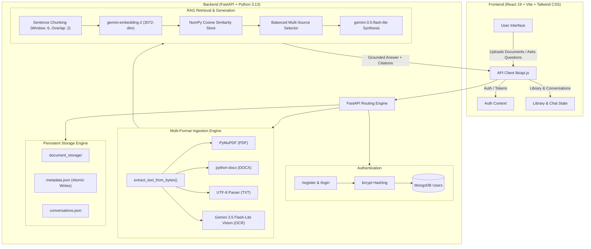

# 🧠 Second Brain: Multi-Format RAG & Document Intelligence Platform

<p align="center">
  
  
  
  
  
  
  
</p>

<p align="center">
  <strong>Transform your PDFs, Word documents, text notes, and images into an interactive, queryable Second Brain with verifiable citations and cross-document reasoning.</strong>
</p>

---

## 📑 Table of Contents

- [✨ Overview](#-overview)
- [⚡ Key Highlights & Capabilities](#-key-highlights--capabilities)
- [🏗️ System Architecture](#️-system-architecture)
- [📂 Supported File Formats](#-supported-file-formats)
- [🎯 RAG Pipeline: How It Works](#-rag-pipeline-how-it-works)
  - [1. Multimodal Text & Vision OCR Extraction](#1-multimodal-text--vision-ocr-extraction)
  - [2. Sentence Chunking with Context Sliding Window](#2-sentence-chunking-with-context-sliding-window)
  - [3. 3072-Dimensional Vector Embeddings](#3-3072-dimensional-vector-embeddings)
  - [4. Balanced Multi-Source Chunk Retrieval](#4-balanced-multi-source-chunk-retrieval)
  - [5. Grounded Answer Synthesis & Citations](#5-grounded-answer-synthesis--citations)
- [💻 Tech Stack](#-tech-stack)
- [🚀 Quickstart & Installation](#-quickstart--installation)
  - [Prerequisites](#prerequisites)
  - [1. Clone Repository](#1-clone-repository)
  - [2. Backend Setup](#2-backend-setup)
  - [3. Frontend Setup](#3-frontend-setup)
- [📡 API Documentation](#-api-documentation)
- [📁 Project Structure](#-project-structure)
- [🛡️ Security & Privacy](#️-security--privacy)
- [🤝 Contributing](#-contributing)
- [📄 License](#-license)

---

## ✨ Overview

**Second Brain** is an end-to-end, production-ready Retrieval-Augmented Generation (RAG) platform. It empowers students, researchers, and professionals to upload study materials and documentation in virtually any format—including scanned receipts and notes—and interrogate their knowledge base with pinpoint precision.

Unlike generic chat tools that hallucinate or provide unsourced answers, Second Brain grounds every single sentence in verified document chunks, attributing citations directly to the source file with similarity scores and exact excerpt snippets.

---

## ⚡ Key Highlights & Capabilities

- 📄 **Simultaneous Multi-File Ingestion**: Upload multiple PDFs, DOCX files, TXT files, and images in a single request.
- 👁️ **Native Multimodal OCR**: Uses Google Gemini 3.5 Flash-Lite vision directly for OCR text extraction—no fragile system binaries (e.g. Tesseract) required.
- ⚖️ **Balanced Multi-Source Vector Retrieval**: Guarantees representative chunks from *every* uploaded document, preventing large documents from crowding out smaller ones or image snippets.
- 🎯 **Verifiable Citations**: Every response returns untruncated source excerpts, chunk IDs, source filenames, and cosine similarity scores.
- 📚 **Persistent Document Library**: Upload once, query anytime (`POST /documents/{id}/ask`) without re-uploading large files.
- 💬 **Cross-Device Chat History**: Thread-safe atomic conversation persistence allowing users to resume previous chats.
- 🔐 **Authentication & Privacy**: Built-in user authentication with `bcrypt` password hashing and secure token sessions backed by MongoDB.
- 🎨 **Modern Dark-Mode UI**: Built with React 19, Tailwind CSS v4, dynamic glassmorphism, responsive chat drawers, and expandable answers.

---

## 🏗️ System Architecture



---

## 📂 Supported File Formats

| Format | Extension | Extractor Engine | Description |
| :--- | :--- | :--- | :--- |
| **PDF Documents** | `.pdf` | `PyMuPDF` (`fitz`) | High-speed text extraction across all document pages |
| **Word Documents**| `.docx`| `python-docx` | Structured paragraph parsing preserving text sequence |
| **Text Documents**| `.txt` | Native Python IO | UTF-8 decoded with automatic fallback replacements |
| **Images & Scans**| `.png`, `.jpg`, `.jpeg` | `gemini-3.5-flash-lite` | Multimodal visual OCR extracting handwritten & printed text |

---

## 🎯 RAG Pipeline: How It Works

### 1. Multimodal Text & Vision OCR Extraction
Files are streamed into memory. Depending on the MIME type and extension, the engine activates the appropriate parser. For images, Gemini's vision model extracts clean, accurate text directly from image bytes.

### 2. Sentence Chunking with Context Sliding Window
Rather than naive character slicing that cuts words in half, text is chunked into **6 full sentences** with a **2-sentence sliding overlap**. Each chunk is stamped with its source filename (e.g. `[lecture_notes.pdf]`).

### 3. 3072-Dimensional Vector Embeddings
Each chunk is individually embedded into a 3072-dimensional vector using Google's state-of-the-art `gemini-embedding-2` model, creating a mathematically dense semantic representation.

### 4. Balanced Multi-Source Chunk Retrieval
When multiple files are uploaded together, standard RAG systems often suffer from **document starvation**—where one large file crowds out chunks from smaller files. 

Our custom **Balanced Multi-Source Retrieval** engine:
1. Computes cosine similarity between the question vector and all chunk vectors.
2. Selects the top relevant chunks from **each** uploaded document.
3. Augments the set with the highest-scoring chunks globally up to a dynamic $top\_k$.
4. Sorts the selected chunks by relevance score.

### 5. Grounded Answer Synthesis & Citations
The curated context is passed to `gemini-3.5-flash-lite` with strict system instructions:
- Answer all parts of compound questions across documents.
- State clearly if a specific piece of information is missing.
- Return structured citations with source filenames, chunk IDs, and similarity scores.

---

## 💻 Tech Stack

### Frontend
- **Framework**: React 19, Vite 8
- **Styling**: Tailwind CSS v4, Custom Glassmorphism CSS Design System
- **Routing**: React Router v7
- **Icons**: Lucide React
- **State Management**: React Context (`AuthContext`, `ThemeContext`)

### Backend
- **Framework**: FastAPI (Python 3.13)
- **ASGI Server**: Uvicorn with auto-reload
- **AI & Embeddings**: Google GenAI SDK (`gemini-3.5-flash-lite`, `gemini-embedding-2`)
- **Document Processing**: `PyMuPDF`, `python-docx`, `Pillow`
- **Vector Operations**: NumPy
- **Authentication**: `bcrypt` password hashing
- **Database**: MongoDB (User management) & Local Atomic Storage (Document library & chats)

---

## 🚀 Quickstart & Installation

### Prerequisites
- **Python**: 3.11 or higher
- **Node.js**: 18.x or higher
- **MongoDB**: Local instance or MongoDB Atlas URI
- **Google Gemini API Key**: Obtainable from [Google AI Studio](https://aistudio.google.com/)

---

### 1. Clone Repository

```bash
git clone https://github.com/Akash10-cell/Retrieval-Augmented-Generation-RAG-.git
cd Retrieval-Augmented-Generation-RAG-
```

---

### 2. Backend Setup

1. Navigate to the backend directory:
   ```bash
   cd rag_backend
   ```

2. Create and activate a Python virtual environment:
   ```bash
   # Windows
   python -m venv venv
   .\venv\Scripts\activate

   # macOS / Linux
   python3 -m venv venv
   source venv/bin/activate
   ```

3. Install required Python packages:
   ```bash
   pip install fastapi uvicorn google-genai pymupdf python-docx python-dotenv numpy pillow bcrypt pymongo httpx
   ```

4. Configure environment variables:
   Create a `.env` file in `rag_backend/`:
   ```env
   gemini-api-key=your_gemini_api_key_here
   my_mongo_uri=mongodb+srv://<username>:<password>@cluster.mongodb.net/?retryWrites=true&w=majority
   ```

5. Start the FastAPI backend:
   ```bash
   uvicorn RAG:app --reload --port 8000
   ```
   *The backend will be live at `http://127.0.0.1:8000` with Swagger docs at `http://127.0.0.1:8000/docs`.*

---

### 3. Frontend Setup

1. Open a new terminal and navigate to the client directory:
   ```bash
   cd client
   ```

2. Install dependencies:
   ```bash
   npm install
   ```

3. Start the Vite development server:
   ```bash
   npm run dev
   ```
   *The web application will open at `http://localhost:5173`.*

---

## 📡 API Documentation

### 1. Simultaneous Multi-File RAG (`POST /rag_3`)
Accepts single or multiple files (PDF, DOCX, TXT, images) and performs balanced semantic retrieval.

- **Content-Type**: `multipart/form-data`
- **Fields**:
  - `file` (File / Repeated Files): Upload one or more documents.
  - `files` (Files, optional): List of files.
  - `question` (Text): The prompt or query.

#### Example Request (cURL):
```bash
curl -X POST "http://127.0.0.1:8000/rag_3" \
  -F "file=@Python_Guide.pdf" \
  -F "file=@Diagram.jpeg" \
  -F "question=Who created Python and what does the diagram illustrate?"
```

#### Example Response:
```json
{
  "status": true,
  "question": "Who created Python and what does the diagram illustrate?",
  "answer": "Based on the provided documents:\n* Python was created by Guido van Rossum in the late 1980s [Python_Guide.pdf].\n* The diagram illustrates an OCR text extraction pipeline [Diagram.jpeg].",
  "processed_files": ["Python_Guide.pdf", "Diagram.jpeg"],
  "citations": [
    {
      "chunk_id": 0,
      "source_file": "Python_Guide.pdf",
      "similarity_score": 0.7241,
      "text_snippet": "[Python_Guide.pdf] Python was conceived in the late 1980s by Guido van Rossum..."
    },
    {
      "chunk_id": 3,
      "source_file": "Diagram.jpeg",
      "similarity_score": 0.6819,
      "text_snippet": "[Diagram.jpeg] Optical Character Recognition pipeline with vision extraction..."
    }
  ]
}
```

---

### 2. Document Management Endpoints

| Method | Endpoint | Description |
| :--- | :--- | :--- |
| `POST` | `/documents` | Store a file to user library (Max 20MB) |
| `GET` | `/documents?owner_email=...` | List all stored documents for a user |
| `GET` | `/documents/{id}/download?owner_email=...` | Download original stored document |
| `DELETE`| `/documents/{id}?owner_email=...` | Permanently delete stored document & metadata |
| `POST` | `/documents/{id}/ask` | Query a stored document directly without re-upload |

---

### 3. Conversation & Authentication Endpoints

| Method | Endpoint | Description |
| :--- | :--- | :--- |
| `POST` | `/register` | Create account with bcrypt password hashing |
| `POST` | `/login` | Authenticate and verify credentials |
| `GET` | `/conversations?owner_email=...` | Retrieve persistent chat history |
| `POST` | `/conversations` | Save new chat interaction |

---

## 📁 Project Structure

```text
Retrieval-Augmented-Generation-RAG-/
├── README.md                           # Comprehensive project documentation
├── client/                             # React 19 + Vite Frontend
│   ├── index.html                      # HTML entry point
│   ├── package.json                    # Frontend dependencies & scripts
│   ├── vite.config.js                  # Vite configuration & proxy settings
│   ├── tailwind.config.js              # Tailwind CSS configuration
│   ├── public/                         # Static assets & brand graphics
│   └── src/
│       ├── App.jsx                     # Root application routing & providers
│       ├── index.css                   # Global design tokens & styling
│       ├── components/
│       │   └── Navbar.jsx              # Navigation header with user session controls
│       ├── context/
│       │   ├── AuthContext.jsx         # User auth state & session storage
│       │   └── ThemeContext.jsx        # Theme state provider
│       ├── lib/
│       │   ├── api.js                  # Frontend API client methods
│       │   └── storage.js              # Client local storage helpers
│       └── pages/
│           ├── LandingPage.jsx         # Hero showcase & value proposition
│           ├── AuthPage.jsx            # Sign In & Registration forms
│           ├── UploadPage.jsx          # Drag-and-drop file upload & query workspace
│           └── LibraryPage.jsx         # Stored document manager & chat drawer
└── rag_backend/                        # FastAPI Backend
    ├── .env                            # Environment credentials (ignored in git)
    ├── RAG.py                          # Core RAG pipeline, vision OCR, & API routes
    ├── Walkthrough.md                  # Detailed backend technical walkthrough
    └── document_storage/               # Local thread-safe persistent file storage
        ├── metadata.json               # Document metadata registry
        └── conversations.json          # Persistent conversation history
```

---

## 🛡️ Security & Privacy

- **No Data Hallucination**: Strict prompt constraints ensure answers are grounded exclusively in uploaded context.
- **Password Security**: Passwords are never stored in plaintext; all credentials are salted and hashed using `bcrypt`.
- **Thread Safety**: File operations and metadata updates use Python's `threading.Lock` with atomic temporary-file replacement.
- **Zero Binary Bloat**: Image OCR is executed via API-based multimodal vision models, avoiding vulnerable binary dependencies on host operating systems.

---

## 🤝 Contributing

Contributions, feedback, and feature requests are welcome!

1. Fork the Project.
2. Create your Feature Branch (`git checkout -b feature/AmazingFeature`).
3. Commit your Changes (`git commit -m 'Add some AmazingFeature'`).
4. Push to the Branch (`git push origin feature/AmazingFeature`).
5. Open a Pull Request.

---

## 📄 License

Distributed under the **MIT License**. See `LICENSE` for more information.

<p align="center">
  Built with ❤️ for curious minds and lifelong learners.
</p>
